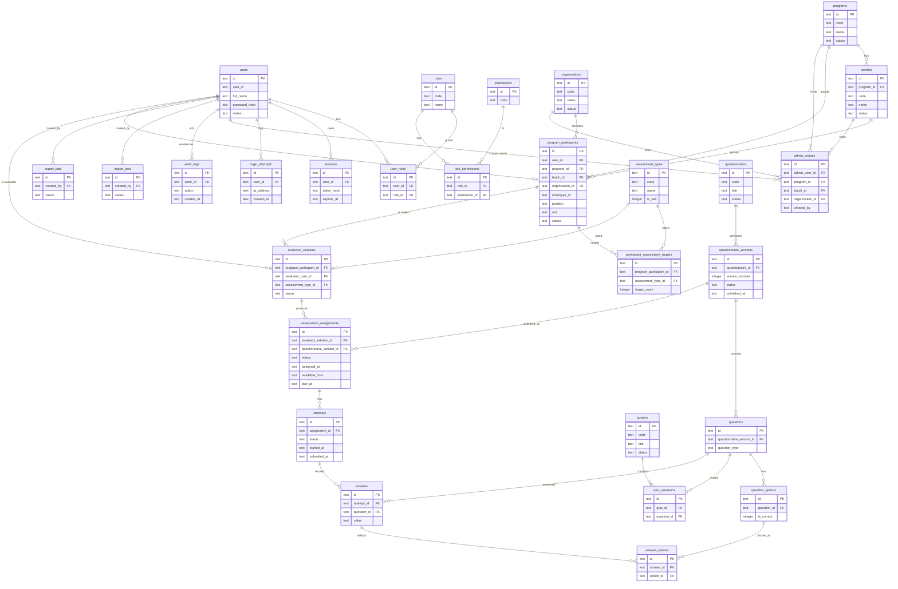

# ERD Draft

## 1. Entity Relationship Diagram



## 2. Cardinality Notes

- users 1:N program_participants
- programs 1:N batches
- programs 1:N program_participants
- batches 1:N program_participants
- organizations 1:N program_participants
- program_participants 1:N participant_assessment_targets
- assessment_types 1:N participant_assessment_targets
- program_participants 1:N evaluator_relations
- users 1:N evaluator_relations sebagai evaluator
- assessment_types 1:N evaluator_relations
- evaluator_relations 1:N assessment_assignments
- questionnaires 1:N questionnaire_versions
- questionnaire_versions 1:N questions
- questionnaire_versions 1:N assessment_assignments
- assessment_assignments 1:N attempts
- attempts 1:N answers
- questions 1:N answers
- question_options 1:N answer_options

Program dan batch dari sebuah evaluator_relation tidak disimpan langsung pada evaluator_relations. Keduanya diperoleh melalui jalur evaluator_relations ke program_participants ke program_id dan batch_id. Hal ini mencegah duplikasi dan menjaga satu sumber kebenaran enrollment pada program_participants.

## 3. Unique Constraints

- unique users.user_id
- unique organizations.code
- unique programs.code
- unique batches(program_id, code)
- unique questionnaire_versions(questionnaire_id, version_number)
- unique program_participants(program_id, batch_id, user_id)
- unique participant_assessment_targets(program_participant_id, assessment_type_id)
- unique evaluator_relations(program_participant_id, evaluator_user_id, assessment_type_id)
- unique answers(attempt_id, question_id)
- unique user_roles(user_id, role_id)
- unique role_permissions(role_id, permission_id)
- unique sessions(token_hash)

Foreign key tambahan:

- answer_options.option_id mereferensikan question_options.id.

## 4. Active Assignment Partial Unique Index

SQLite dan Cloudflare D1 tidak mendukung filter unique melalui konstrain tabel biasa, sehingga aturan satu assignment aktif per kombinasi evaluator_relation_id dan questionnaire_version_id diterapkan melalui partial unique index.

Status assignment yang dianggap aktif:

- ASSIGNED
- AVAILABLE
- IN_PROGRESS

Status yang tidak dianggap aktif dan tidak terkena pembatasan ini:

- SUBMITTED
- EXPIRED
- CLOSED
- CANCELLED

Definisi index:

```sql
CREATE UNIQUE INDEX ux_active_assignment
ON assessment_assignments (evaluator_relation_id, questionnaire_version_id)
WHERE status IN ('ASSIGNED', 'AVAILABLE', 'IN_PROGRESS');
```

Index ini mencegah lebih dari satu assignment aktif untuk pasangan evaluator_relation_id dan questionnaire_version_id yang sama, sambil tetap mengizinkan beberapa assignment historis yang sudah tidak aktif.

## 5. Not Null Notes

- program_participants.batch_id bersifat NOT NULL. Setiap participant wajib masuk ke dalam satu batch.
- program_participants.organization_id bersifat nullable.
- admin_scopes.program_id, admin_scopes.batch_id, dan admin_scopes.organization_id bersifat nullable, dan masing-masing memiliki foreign key valid ke tabel terkait.
